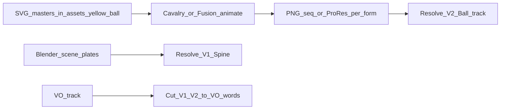

# How to Use the Yellow Ball (+ Ball-Head Humans) in the Video

**Goal:** Get the hero ball and YB-Body humanity forms onto the Episode 01 cut in Resolve.  
**Hero rule:** Yellow ball identity only — faceless torsos when humanity is needed.  
**Art direction:** Soft-pop (Blue Eye Samurai × Frieren × Kirikou) — completed prompt in `docs/claude_soft_pop_completed_prompt.md`.

---

## 1. Picture stack (Resolve)

| Track | What goes here |
|-------|----------------|
| **V1** | Scene plates (Blender masters / kinetic B-roll) |
| **V2** | **Yellow ball layer** — all forms (sphere, coin, orb, **YB-Body**, crowd) |
| **V3–V4** | Extra B-roll only (optional kinetic) |
| **V5** | Stats / labels (`$984M`, `97%`, etc.) |
| **A1** | VO (edit picture to this) |

Ball never lives only “baked into” V1 if you can help it — keep it on **V2** so you can retimemorph without re-rendering whole scenes.

---

## 2. Asset → tool → timeline

| Asset | Use in video |
|-------|----------------|
| `yb_sun_seed.svg` → `export/yb_sun_seed.png` | Default hero sphere |
| `yb_mpesa_coin.svg` → `export/…png` | S02 morph target |
| `yb_data_orb.svg` → `export/…png` | S05 |
| `yb_body_single.svg` → `export/…png` | One person (S03 builder / S08 founder) |
| `yb_body_crowd.svg` → `export/…png` | Groups (S01, S09) |
| `yb_body_founder_dim.svg` → `export/…png` | Lonely S08 |

**Affinity (optional):** Build layered `.af` from SVGs → import to Resolve 21 or export PNG.  
**Cavalry (best for motion):** Rig morph + bob + crowd stagger → export ProRes/PNG seq → V2.  
**Fusion (in Resolve):** If no Cavalry — animate PNG overlays with Transform + Merge on V2.

---

## 3. Scene-by-scene: what the viewer sees

| Time / Scene | V1 (world) | V2 (ball) | VO cue to hit |
|--------------|------------|-----------|---------------|
| **S01** | Dawn skyline / matatu plate | Sun-seed rises → **morph to crowd ball-heads** | “people’s pockets” / “matatus” |
| **S02** | 2007 kiosk | Crowd morphs **back to ball** → squash to **coin** → into phone | “2007” / “M-Pesa” |
| **S03** | Coworking | Ball splits / orbits → **ball-head at desk** | “iHub” / “builders” |
| **S04** | Phone CU | Body morphs **back to ball** → enters screen glow | “small screen” |
| **S05** | Chart | **Data orb** only (no bodies — protect clarity) | “billion” / “82%” |
| **S06** | Solar | Orb → **sun-disk** | “solar” / “M-Pesa instinct” |
| **S07** | Kenya map | Small bright ball on Nairobi only | “ninety-seven percent” |
| **S08** | Quiet street | **Dim ball-head founder** (slow bob) | “pre-seed” / “founder after founder” |
| **S09** | Dusk skyline | Reignite → **crowd ball-heads** + gold arcs | “dozens of them” / “forecast” |
| **S10** | End card | Crowd → pure ball → into **AFRICA** logo | Music resolve |

---

## 4. Morph recipe (every humanity beat)

1. Hold abstract ball 1–2s  
2. **12–18 frames:** ball drops onto neck *or* grows torso downward  
3. Hold YB-Body with **idle head bob**  
4. On exit beat: **10–14 frames** reverse morph to sphere  
5. Continue next abstract form  

Crowd: duplicate single body 5–8×, stagger bob by 8–12 frames — don’t animate each uniquely.

---

## 5. Practical edit steps (today)

### A. Prepare overlays — ✅ DONE
Transparent PNG stills (RGBA) are in:

`C:\Users\HP\OneDrive\The Vault\Africa Season 1\assets\yellow_ball\export\`

| PNG | Role |
|-----|------|
| `yb_sun_seed.png` | Default hero sphere (512) |
| `yb_mpesa_coin.png` | S02 coin morph (512) |
| `yb_data_orb.png` | S05 data orb (512) |
| `yb_dim_gap.png` | Dim / gap ball (512) |
| `yb_forecast_beacon.png` | S09 forecast beacon (512) |
| `yb_body_single.png` | Single YB-Body (320×512) |
| `yb_body_crowd.png` | Crowd ball-heads (768×448) |
| `yb_body_founder_dim.png` | Lonely S08 founder (320×512) |
| `yb_hub_orbit.png` | iHub / Andela / NaiLab orbit |
| `sasa_seed.png` / `sasa_pop.png` / `sasa_burst.png` | Legacy Sasa variants |

*(Rasterized with Pillow to match SVG masters — cairo/Inkscape not available on this machine.)*

### B. Resolve — ✅ markers + import done
1. Project **Africa Season 1** → timeline **Episode 01 - Assembly** (start TC `01:00:00:00` / start_frame 86400; marker frames are **relative**, frame 0 = first frame)  
2. **V2** track named **Ball** added  
3. Media Pool folder **Yellow Ball** — all export PNGs imported  
4. Lay VO on A1  
5. Place ball clips on V2; **ripple/slip to VO words** / YB markers below  
6. Composite: Screen / Normal with alpha; size ball ~120–180px (sphere) / figure ~280–400px tall  

#### YB morph / stats markers (completed)

| Rel. frame | Name | Color | Note |
|------------|------|-------|------|
| 0 | `YB_S01_RISE` | Yellow | Sun-seed rises |
| 360 | `YB_S01_BODY_CROWD` | Yellow | People’s pockets → crowd |
| 1080 | `YB_S02_COIN` | Yellow | M-Pesa coin |
| 2040 | `YB_S03_BODY_BUILDER` | Yellow | Builder ball-head |
| 3240 | `YB_S04_PHONE` | Yellow | Back to ball → phone |
| 3720 | `YB_S05_ORB` | Yellow | Data orb |
| 4680 | `YB_S05_82` | Green | Stat 82% |
| 5400 | `YB_S07_97` | Green | Stat 97% |
| 6000 | `YB_S08_FOUNDER_DIM` | Yellow | Dim founder |
| 6840 | `YB_S09_CROWD_REIGNITE` | Yellow | Crowd reignite |
| 8280 | `YB_S10_LOCK` | Yellow | Lock into AFRICA logo |

Yellow = ball morph; Green = stats. `customData`: `yb_morph` / `yb_stats`.

### C. Blender (only if baking into scenes)
- Parent ball empty in scenes where you want it “in world space” (map Nairobi glow)  
- Prefer Resolve V2 for body morphs so you don’t re-render 7 minutes for every timing tweak  

### D. Audio
- Soft “pop” on morph to body  
- Softer whoosh on morph back to sphere  
- Crowd: light multi-tick stagger (optional)

---

## 6. What “done” looks like

- Mute test: you can still follow the story by watching the ball change form  
- Humanity beats show **yellow heads + faceless bodies**, never faces  
- Stats ($984M / 97%) stay readable — no crowd over the numbers  
- Ball (or ball-head) visible every chapter  

---

## 7. Next (say which)

1. ~~Build Resolve V2 markers~~ ✅  
2. ~~Generate PNG stills~~ ✅ → `assets/yellow_ball/export/`  
3. **Lay PNG stills on V2** at YB markers; slip to VO  
4. **Run kinetic preview** with ball-head overlays composited  
5. **Blender empty + import** script for S07 map ball only  

Default recommendation: **drop export PNGs onto V2 at the YB markers**, then animate morphs in Cavalry/Fusion.
