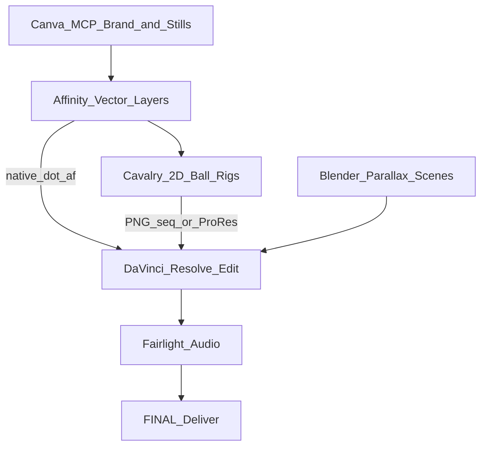

# The Yellow Ball Throughline — Silicon Savannah

**Theme:** Tech growth × African excellence  
**Motif:** A single yellow sphere that never leaves the frame language — it transforms with the story.  
**Reference DNA:** TED-Ed bouncing-ball timing/spacing + AFRICA S1 TED-Ed style bible  
**Hero color:** `#FFD54F` (excellence gold) with `#E8845C` dawn warmth and `#00E676` growth accents  
**Soft-pop companion (fields only):** Claude mustard `#D9A441`, dusty indigo `#2E3A50`, cream `#F1E4C8` — see `docs/claude_soft_pop_completed_prompt.md`. Hero ball stays `#FFD54F` so it still pops.

---

## Core Metaphor (Hybrid Sun-Seed)

The yellow ball is **not a logo sticker**. It is:

1. **Sun** — African excellence / dawn over Nairobi  
2. **Seed** — an idea / startup that can grow  
3. **Shilling pulse** — mobile money in motion  
4. **Capital node** — funding and scale  
5. **Beacon** — forecast for Lagos, Kigali, Accra

**Rule:** If the ball is removed and the story still “reads,” the motif is too weak. Every major beat should use a **transformation**, not a static float.

### Hero lock (Ep 1 decision)
- **Yellow ball is the only hero identity.** No faces, no competing mascots, no realistic humans.
- Brand / UN / Visa / Microsoft stay as **stylized icons**, not people.
- **Humanity form:** When a beat needs people, the ball **transforms** into a **faceless torso with the yellow ball as the head** (no facial features — ever).
- **Crowds:** Same format — many faceless torsos, each with a yellow-ball head (identical language, varied scale/pose only).
- The ball-head figure is still *the ball* — not a second character system. Morph into it and morph back.

### Ball-head human (YB-Body) — design rules

| Part | Spec |
|------|------|
| Head | Exact yellow ball (`#FFD54F`), same gradient/glow as hero sphere — **no eyes, mouth, hair** |
| Torso | Flat faceless body, charcoal / slate (`#37474F` or chapter-muted) — no skin tones, no clothing logos |
| Limbs | Simple rounded sticks or slab arms; minimal articulation |
| Scale | Single figure: ball = ~18–22% of figure height; crowd heads slightly smaller |
| Motion | Walk = soft bob of ball-head; gesture = arm only; crowd = staggered bob 8–12f apart |
| Transform | Ball descends onto neck OR expands downward growing a torso (12–18f morph) |

**Use when:** S01 “people’s pockets” / matatu passengers, S03 builders at desks, S08 “founder after founder”, S09 “dozens of them”.  
**Do not use when:** Pure data (S05 chart), map slam (S07 97%), end card — keep abstract ball forms.

---

## Transformation Arc (10 Scenes)

| Scene | Ball Form | Motion (TED-Ed timing) | Meaning |
|-------|-----------|------------------------|---------|
| **S01 Cold Open** | Rising sun-seed → brief **crowd of ball-heads** in matatu / street | Soft pulse then morph to torso-heads on “people’s pockets” | Excellence waking; humanity as yellow-headed figures |
| **S02 Context 2007** | Compresses into a coin / M-Pesa pulse | Squash on “2007”; bounce into phone | Local problem → money system |
| **S03 Hubs** | Splits to 3 orbits → **ball-head builders** at desks | Staggered bob; one hero ball-head stands | Community multiplies the seed |
| **S04 Phone** | Enters the phone screen as UI glow | Tight push-in; ball becomes screen highlight | Mobile-first generation |
| **S05 Money** | Inflates into neon data orb → bar-chart energy | Riser + count-up sync | Measurable growth ($984M) |
| **S06 Solar** | Morphs into a sun-disk over panels | Warm shimmer loop | Same playbook → energy |
| **S07 Gap** | Shrinks; Nairobi holds the bright ball; regions dim | Pre-reveal dip; slam on 97% | Concentration / inequality |
| **S08 Secondary** | Dimmed ball → **single ball-head founder** (desaturated torso) | Slow walk-bob; lonely framing | Pre-seed gap / quiet struggle |
| **S09 Closer** | Re-ignites → **crowd of ball-heads** (“dozens of them”) | Gold arcs between heads / icons | World arrives; forecast |
| **S10 End Card** | Settles into the “A” of AFRICA / orbiting logo | Resolve chord; hold 8s | Series identity lock |

```mermaid
flowchart LR
  sunSeed[S01_SunSeed] --> coinPulse[S02_MPesaPulse]
  coinPulse --> hubOrbit[S03_HubOrbit]
  hubOrbit --> phoneGlow[S04_PhoneGlow]
  phoneGlow --> dataOrb[S05_DataOrb]
  dataOrb --> sunDisk[S06_SolarSun]
  sunDisk --> dimBeacon[S07_Concentrated]
  dimBeacon --> quietRoll[S08_DimRoll]
  quietRoll --> goldBeacon[S09_Reignite]
  goldBeacon --> logoLock[S10_AFRICA]
```

---

## Visual Spec — Ball Design System

| Property | Value |
|----------|-------|
| Base fill | `#FFD54F` |
| Highlight | `#FFF8E1` (top-left specular) |
| Rim / shadow | `#F9A825` → `#E65100` soft edge |
| Glow (active) | Outer glow `#FFD54F` @ 40–60% opacity |
| Dim state (S07–08) | Desaturate 40%, opacity 55% |
| Size (1080p) | Hero: 120–180px; UI pulse: 48–72px; orbit nodes: 36–48px |
| Never | Flat emoji circle; purple glow; cream-paper look |

**Motion principles (from TED-Ed timing/spacing):**
- Spacing communicates force (gravity, momentum, growth)
- Same timing + different spacing = different story
- Ease-in to impact, ease-out on rise
- Hold 1.5–2s on transform completes before next action

---

## Tool Pipeline (Canva · Affinity · Cavalry · Resolve)

### Canva (MCP — connected)
- Create 1920×1080 still boards for each ball state
- Brand Kit color `#FFD54F`
- Stock photos: Nairobi dawn, coworking, solar, phones (as **reference plates**, not final look — illustration-first)
- Export PNG → project `assets/yellow_ball/` and `assets/canva/`

### Affinity (sister app — no MCP yet; manual + Resolve .af)
- Build layered `.af` ball masters (fill / highlight / glow / trail)
- One master file per form: `YB_SunSeed.af`, `YB_Coin.af`, `YB_DataOrb.af`, …
- Resolve 21+: import `.af` natively; **Split Layers into Place**; live refresh on save
- Guides: [Affinity ↔ Resolve integration](https://www.affinity.studio/integrations), [Resolve 21 .af support](https://jayaretv.com/news/davinci-resolve-21-native-affinity-file-support/)

### Cavalry (Canva ecosystem — free with Canva account)
- Animate ball timing/spacing procedurally (duplicator for hub orbits)
- Export PNG sequence or ProRes for Resolve Fusion overlay track
- Guides: [Cavalry free with Canva](https://www.canva.com/help/free-cavalry-access/), [Cavalry site](https://cavalry.studio/en/)

### DaVinci Resolve (MCP — editorial)
- VO-first spine; ball overlays on V2/V3
- Markers at each transform beat
- Fusion: TextStat + ball trail comps
- Fairlight: SFX on each transform word
- Color: chapter LUTs with yellow ball as constant accent

---

## Editorial Beat Sheet (Resolve Markers)

| Frame | Marker | Ball Action | VO Trigger |
|-------|--------|-------------|------------|
| 0 | YB_S01_RISE | Sun-seed rises | "Six-thirty… Nairobi" |
| 360 | YB_S01_PULSE | Transaction pulse | "money has already moved" |
| 1080 | YB_S02_COIN | Morph to coin | "2007… M-Pesa" |
| 2040 | YB_S03_SPLIT | Split to 3 hubs | "iHub… Andela… NaiLab" |
| 3240 | YB_S04_PHONE | Enter phone UI | "small screen" |
| 3720 | YB_S05_ORB | Inflate data orb | "measurable… billion" |
| 4680 | YB_S05_82 | Flash on 82% | "eighty-two percent" |
| 5400 | YB_S07_DIM | Shrink / concentrate | "ninety-seven percent" |
| 6840 | YB_S09_REIGNITE | Gold arcs to icons | "Microsoft… Visa… forecast" |
| 8280 | YB_S10_LOCK | Settle into AFRICA | End card |

---

## Stock Footage Brief (Canva / Mixkit — use sparingly)

TED-Ed style stays **illustration-led**. Stock is for texture plates only:

| Need | Search terms | Use |
|------|--------------|-----|
| Dawn city | Nairobi sunrise, African city dawn | S01 plate under vectors |
| Hands + phone | mobile money, smartphone Africa | S04 reference |
| Solar rooftop | solar panels suburb | S06 plate |
| Coworking | laptop desks Africa | S03 mood only |

Prefer Canva illustrations / Affinity vectors over photoreal B-roll for the final look.

---

## Online Guides Worth Following

1. [TED-Ed: Timing and Spacing (bouncing ball)](https://ed.ted.com/lessons/animation-basics-the-art-of-timing-and-spacing-ted-ed) — physics of the ball  
2. [TED-Ed Animation Basics 101](https://ed.ted.com/blog/2016/07/13/animation-basics-101) — visual metaphors for abstract ideas  
3. [Affinity → Resolve native .af](https://www.affinity.studio/integrations) — live design-to-edit  
4. [Resolve 21 Affinity layers](https://jayaretv.com/news/davinci-resolve-21-native-affinity-file-support/) — Split Layers into Place  
5. [Cavalry for Canva](https://www.canva.com/newsroom/news/cavalry/) — procedural motion for the ball rig  
6. Project local: `docs/teded_style_bible.md`, `docs/teded_scene_spec_ep01.md`

---

## Success Criteria

- Yellow ball visible (or purposefully dimmed) in every chapter  
- At least **8 distinct transforms** across the episode  
- Ball color `#FFD54F` survives grading as excellence accent  
- Resolve markers named `YB_*` for editorial clarity  
- Affinity masters + Canva stills archived under `assets/yellow_ball/`
